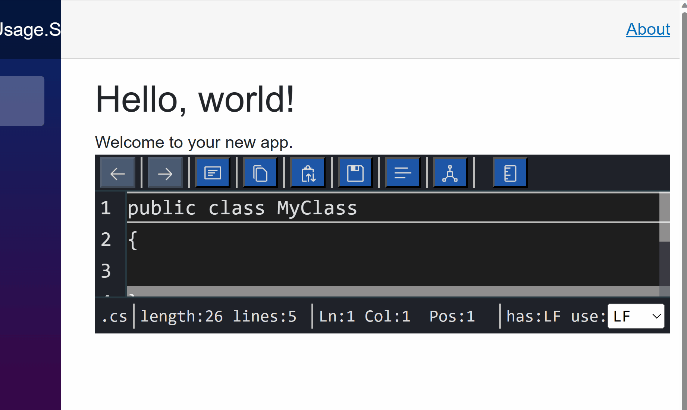

# Luthetus.TextEditor (v1.4.0)

## Usage

### Source Code
The .NET Solution: [Luthetus.TextEditor.Usage.sln](../../Source/Tutorials/TextEditor/Luthetus.TextEditor.Usage.sln),
was made by following steps described here. So, the completed result can be found there.

### Goal

- Render a C# Text Editor which makes use of the CSharpCompilerService


### Steps
- Create a codebehind for the file: `Pages/Index.razor`

```csharp
// Pages/Index.razor.cs

using Microsoft.AspNetCore.Components;

namespace Luthetus.TextEditor.Usage.RazorLib.Pages;

public partial class Index : ComponentBase
{
}
```

- There are 2 parts to rendering a Text Editor.

- First, one needs to make a `TextEditorModel`.

- Then, one needs to make a `TextEditorViewModel` for that previously made `model`.

- In Index.razor.cs add the following line of code:

```csharp
// using Luthetus.TextEditor.RazorLib.Lexes.Models;
private static readonly ResourceUri TextEditorResourceUri = new ResourceUri("/index");
```

- The `ResourceUri` is a unique identifier for a given `TextEditorModel`.

- One might think of a `TextEditorModel` as mapping to a file on their filesystem, as an example.

- Override the Blazor lifecycle method named: `OnInitialized()`

```csharp
protected override void OnInitialized()
{
    base.OnInitialized();
}
```

- Inside this override, and above the `base.OnInitialized();` invocation, we can register the `TextEditorModel`.

- We need access to the `ITextEditorService` to register a `TextEditorModel`. So, inject the `ITextEditorService`.

```csharp
// using Luthetus.TextEditor.RazorLib.TextEditors.Models;
[Inject]
private ITextEditorService TextEditorService { get; set; } = null!;
```

- The `ITextEditorService` has public properties that encapsulate the API for a given datatype in the `Luthetus.TextEditor` namespace. For example, `TextEditorService.Model` accesses the `Model` property, which has all of the API related to the `TextEditorModel` datatype.

- By invoking `TextEditorService.Model.RegisterCustom(...);`, we can create register a TextEditorModel. The `RegisterCustom(...)` method takes as a parameter an instance of `TextEditorModel`. So we need to make that instance.

- In the override for `OnInitialized()`, create an instance of a `TextEditorModel`. Then, pass it in to the `TextEditorService.Model.RegisterCustom(...)` invocation.

- In order to create an instance of the `TextEditorDefaultCompilerService` one needs access to the `IBackgroundTaskService` and `IDispatcher`. These can be injected as shown in the following code snippet.

```csharp
// using Luthetus.Common.RazorLib.BackgroundTasks.Models;
[Inject]
private IBackgroundTaskService BackgroundTaskService { get; set; } = null!;
// using Fluxor;
[Inject]
private IDispatcher Dispatcher { get; set; } = null!;
```

```csharp
protected override void OnInitialized()
{
    var textEditorModel = new TextEditorModel(
        TextEditorResourceUri,
        DateTime.UtcNow,
        ".cs",
        "public class MyClass\n{\n\n}\n",
        new GenericDecorationMapper(),
        new TextEditorDefaultCompilerService(
            TextEditorService, BackgroundTaskService, Dispatcher),
        null,
        new());

    TextEditorService.Model.RegisterCustom(textEditorModel);

    base.OnInitialized();
}
```

- In order to render a `TextEditorModel`, we need a `TextEditorViewModel`. A file on one's operating system would relate to a `model`. Whereas, an open text editor would relate to a `viewModel`.

- Many `TextEditorViewModel` can reference an underlying `TextEditorModel`. But, only 1 `model` for a given file on one's operating system can exist.

> *NOTE:* I use an example of a operating system's file system but, it is just an example, one can make a TextEditorModel out of "thin air" if they'd like to.

- We need a TextEditorViewModelKey so we can maintain the TextEditorViewModel state between page changes.

- Add the following line of code:

```csharp
private static readonly Key<TextEditorViewModel> TextEditorViewModelKey = Key<TextEditorViewModel>.NewKey();
```

- Now, in the override for `OnInitialized()`, invoke `TextEditorService.ViewModel.Register(...)`.

```csharp
TextEditorService.ViewModel.Register(
    TextEditorViewModelKey,
    TextEditorResourceUri);
```

- My `Pages/Index.razor.cs` file as of this step looks as follows:

```csharp
using Luthetus.TextEditor.RazorLib.CompilerServices.GenericLexer.Decoration;
using Luthetus.TextEditor.RazorLib.CompilerServices;
using Luthetus.TextEditor.RazorLib.Lexes.Models;
using Luthetus.TextEditor.RazorLib.TextEditors.Models;
using Microsoft.AspNetCore.Components;
using Luthetus.Common.RazorLib.BackgroundTasks.Models;
using Fluxor;
using Luthetus.Common.RazorLib.Keys.Models;

namespace Luthetus.TextEditor.Usage.RazorLib.Pages;

public partial class Index : ComponentBase
{
    [Inject]
    private ITextEditorService TextEditorService { get; set; } = null!;
    [Inject]
    private IBackgroundTaskService BackgroundTaskService { get; set; } = null!;
    [Inject]
    private IDispatcher Dispatcher { get; set; } = null!;

    private static readonly ResourceUri TextEditorResourceUri = new ResourceUri("/index");
    private static readonly Key<TextEditorViewModel> TextEditorViewModelKey = Key<TextEditorViewModel>.NewKey();

    protected override void OnInitialized()
    {
        var textEditorModel = new TextEditorModel(
            TextEditorResourceUri,
            DateTime.UtcNow,
            ".cs",
            "public class MyClass\n{\n\n}\n",
            new GenericDecorationMapper(),
            new TextEditorDefaultCompilerService(
                TextEditorService, BackgroundTaskService, Dispatcher),
            null,
            new());

        TextEditorService.Model.RegisterCustom(textEditorModel);

        TextEditorService.ViewModel.Register(
            TextEditorViewModelKey,
            TextEditorResourceUri);

        base.OnInitialized();
    }
}
```

- In the .razor markup (`Pages/Index.razor`) render the Blazor component: `<Luthetus.TextEditor.RazorLib.TextEditors.Displays.TextEditorViewModelDisplay/>`

- This component takes various parameters, but only one of them is required. The rest of the parameters are for customization.

- Pass in the required parameter `TextEditorViewModelKey` to have the value of the `TextEditorViewModelKey` property from the codebehind.

```csharp
@page "/"
@using Luthetus.TextEditor.RazorLib.TextEditors.Displays

<PageTitle>Index</PageTitle>

<h1>Hello, world!</h1>

Welcome to your new app.

<TextEditorViewModelDisplay TextEditorViewModelKey="TextEditorViewModelKey" />
```

- The following GIF shows how the Text Editor looks at this step.



- Now we can add in the C# Compiler Service.

- Reference the `Luthetus.CompilerServices.CSharp` Nuget Package

Go to the file that you register your services and add the following lines of C# code.

> *NOTE:* In many C# Project templates, the services are registered in `Program.cs`.

```csharp
using Luthetus.CompilerServices.Lang.CSharp.CompilerServiceCase;

services.AddScoped<CSharpCompilerService>();
```

- In the `Pages/Index.razor.cs` file we now can provide the `CSharpCompilerService` when instantiating a `TextEditorModel`.

- `CSharpCompilerService` is written such that one can re-use a singular instance. This then results in the compiler service understanding the one or many files that have been registered with it.

- Create a private field for an instance of `CSharpCompilerService` with name, `_cSharpCompilerService`.

```csharp
private CSharpCompilerService _cSharpCompilerService = null!;
```

- In `OnInitialized()` assign to `_cSharpCompilerService` a new instance of the `CSharpCompilerService`.

```csharp
_cSharpCompilerService = new CSharpCompilerService(
    TextEditorService, BackgroundTaskService, Dispatcher);
```

- Then pass in `_cSharpCompilerService` instance instead of `new TextEditorDefaultCompilerService(...)` when invoking the `TextEditorModel` constructor.

- One last step, on the line immediately following, `TextEditorService.Model.RegisterCustom(textEditorModel);` add the line: `_cSharpCompilerService.RegisterResource(textEditorModel.ResourceUri);`

- My `Pages/Index.razor.cs` file as of this step is shown in the following code snippet:

```csharp
using Luthetus.TextEditor.RazorLib.CompilerServices.GenericLexer.Decoration;
using Luthetus.TextEditor.RazorLib.CompilerServices;
using Luthetus.TextEditor.RazorLib.Lexes.Models;
using Luthetus.TextEditor.RazorLib.TextEditors.Models;
using Microsoft.AspNetCore.Components;
using Luthetus.Common.RazorLib.BackgroundTasks.Models;
using Fluxor;
using Luthetus.Common.RazorLib.Keys.Models;
using Luthetus.CompilerServices.Lang.CSharp.CompilerServiceCase;

namespace Luthetus.TextEditor.Usage.RazorLib.Pages;

public partial class Index : ComponentBase
{
    [Inject]
    private ITextEditorService TextEditorService { get; set; } = null!;
    [Inject]
    private IBackgroundTaskService BackgroundTaskService { get; set; } = null!;
    [Inject]
    private IDispatcher Dispatcher { get; set; } = null!;

    private static readonly ResourceUri TextEditorResourceUri = new ResourceUri("/index");
    private static readonly Key<TextEditorViewModel> TextEditorViewModelKey = Key<TextEditorViewModel>.NewKey();

    private CSharpCompilerService _cSharpCompilerService = null!;

    protected override void OnInitialized()
    {
        _cSharpCompilerService = new CSharpCompilerService(
            TextEditorService, BackgroundTaskService, Dispatcher);

        var textEditorModel = new TextEditorModel(
            TextEditorResourceUri,
            DateTime.UtcNow,
            ".cs",
            "public class MyClass\n{\n\n}\n",
            new GenericDecorationMapper(),
            _cSharpCompilerService,
            null,
            new());

        TextEditorService.Model.RegisterCustom(textEditorModel);

        _cSharpCompilerService.RegisterResource(textEditorModel.ResourceUri);

        TextEditorService.ViewModel.Register(
            TextEditorViewModelKey,
            TextEditorResourceUri);

        base.OnInitialized();
    }
}
```

- Now you should have a Text Editor with the CSharpCompilerService as shown in this GIF:


# Next tutorial: #TODO: Continue