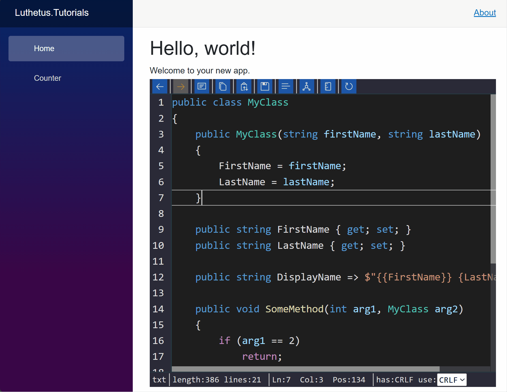
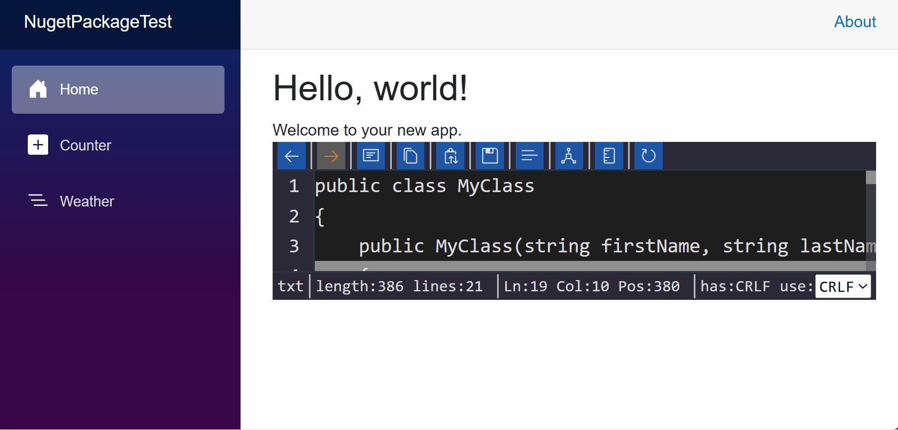

# Luthetus.TextEditor (v2.1.0)

## Usage

### Source Code
The .NET Solution: [Luthetus.Tutorials.sln](../../Source/Tutorials/Luthetus.Tutorials.sln),
was made by following steps described here. So, the completed result can be found there.

### Goal



- Render a C# Text Editor which makes use of the CSharpCompilerService

### Steps
- Create a codebehind for the file: `Pages/Index.razor`

```csharp
// Pages/Index.razor.cs

using Microsoft.AspNetCore.Components;

namespace Luthetus.Tutorials.RazorLib.Pages;

public partial class Index : ComponentBase
{
}
```

- There are 2 parts to rendering a Text Editor.

- First, one needs to make a [TextEditorModel](/Source/Lib/TextEditor/TextEditors/Models/TextEditorModel.Constructors.cs).

- Then, one needs to make a [TextEditorViewModel](/Source/Lib/TextEditor/TextEditors/Models/TextEditorViewModel.cs) for that previously made `model`.

- In Index.razor.cs add the following line of code:

```csharp
// using Luthetus.TextEditor.RazorLib.Lexers.Models;
public static ResourceUri ResourceUri { get; } = new("/index.txt");
```

- The [ResourceUri](/Source/Lib/TextEditor/Lexers/Models/ResourceUri.cs) is a unique identifier for a given `TextEditorModel`.

- One might think of a `TextEditorModel` as mapping to a file on their filesystem, as an example.

- Override the Blazor lifecycle method named: `OnInitialized()`

```csharp
protected override void OnInitialized()
{
    base.OnInitialized();
}
```

- Inside this override, and above the `base.OnInitialized();` invocation, we can register the `TextEditorModel`.

- We need access to the [ITextEditorService](/Source/Lib/TextEditor/ITextEditorService.cs) to register a `TextEditorModel`. So, inject the `ITextEditorService`.

```csharp
// using Luthetus.TextEditor.RazorLib;
[Inject]
private ITextEditorService TextEditorService { get; set; } = null!;
```

- The `ITextEditorService` has public properties that encapsulate the API for a given datatype in the `Luthetus.TextEditor` namespace. For example, `TextEditorService.ModelApi` accesses the `ModelApi` property, which has all of the API related to the `TextEditorModel` datatype.

- By invoking `TextEditorService.ModelApi.RegisterCustom(...);`, we can create register a TextEditorModel. The `RegisterCustom(...)` method takes as parameters: an instance of `TextEditorModel`, and a [TextEditorEditContext](https://github.com/Luthetus/Luthetus.Ide/blob/main/Source/Lib/TextEditor/TextEditorEditContext.cs#L9). So we need to make the `TextEditorModel` instance.

- In the override for `OnInitialized()`, create an instance of a `TextEditorModel`.

- Now, we need the `TextEditorEditContext`. Invoke `TextEditorService.TextEditorWorker.PostUnique(...)`. The first argument is a "name" for the work item. The second argument is a Func that will provide you a `TextEditorEditContext` instance, and excepts you to return a `ValueTask`.

- Inside the `TextEditorService.TextEditorWorker.PostUnique(...)` Func argument, go on to in the body of the Func, invoke `TextEditorService.Model.RegisterCustom(...)`. Pass the `TextEditorEditContext` that the Func provided, and the instance of the `TextEditorModel`.

```csharp
protected override void OnInitialized()
{
    var model = new TextEditorModel(
	        ResourceUri,
	        DateTime.UtcNow,
	        ExtensionNoPeriodFacts.TXT,
	        @"public class MyClass
{
	public MyClass(string firstName, string lastName)
	{
		FirstName = firstName;
		LastName = lastName;
	}
	
	public string FirstName { get; set; }
	public string LastName { get; set; }
	
	public string DisplayName => $""{{FirstName}} {LastName}"";
	
	public void SomeMethod(int arg1, MyClass arg2)
	{
		if (arg1 == 2)
			return;
		
		return;
	}
}",
	    decorationMapper: null,
        compilerService: null);

	TextEditorService.TextEditorWorker.PostUnique(nameof(Index), editContext =>
	{
    	TextEditorService.ModelApi.RegisterCustom(editContext, model);
	});

    base.OnInitialized();
}
```

- In order to render a `TextEditorModel`, we need a [TextEditorViewModel](/Source/Lib/TextEditor/TextEditors/Models/TextEditorViewModel.cs). A file on one's operating system would relate to a `model`. Whereas, an open text editor would relate to a `viewModel`.

- Many `TextEditorViewModel` can reference an underlying `TextEditorModel`. But, only 1 `model` for a given file on one's operating system can exist.

> *NOTE:* I use an example of a operating system's file system but, it is just an example, one can make a TextEditorModel out of "thin air" if they'd like to.

- We need a TextEditorViewModelKey so we can maintain the TextEditorViewModel state between page changes.

- Add the following line of code:

```csharp
public static Key<TextEditorViewModel> ViewModelKey { get; } = Key<TextEditorViewModel>.NewKey();
```

- Now, in the override for `OnInitialized()`, invoke `TextEditorService.ViewModelApi.Register(...)`.

> *NOTE:* The argument 'Category' to 'TextEditorService.ViewModelApi.Register(...)' can be passed as 'new Category("main")'. It acts only as a way to filter a list of view models.

```csharp
TextEditorService.ViewModelApi.Register(
    ViewModelKey,
    ResourceUri,
    new Category("main"));
```

- My `Pages/Index.razor.cs` file as of this step looks as follows:

```csharp
using Microsoft.AspNetCore.Components;
using Luthetus.Common.RazorLib.Keys.Models;
using Luthetus.TextEditor.RazorLib;
using Luthetus.TextEditor.RazorLib.TextEditors.Models;
using Luthetus.TextEditor.RazorLib.Lexers.Models;
using Luthetus.TextEditor.RazorLib.CompilerServices.Interfaces;
using Luthetus.TextEditor.RazorLib.Decorations.Models;

namespace Luthetus.Tutorials.RazorLib.Pages;

public partial class Index : ComponentBase
{
	[Inject]
	private ITextEditorService TextEditorService { get; set; } = null!;

	public static ResourceUri ResourceUri { get; } = new("/index.txt");
	public static Key<TextEditorViewModel> ViewModelKey { get; } = Key<TextEditorViewModel>.NewKey();
	
	protected override void OnInitialized()
	{
		var model = new TextEditorModel(
	        ResourceUri,
	        DateTime.UtcNow,
	        ExtensionNoPeriodFacts.TXT,
	        @"public class MyClass
{
	public MyClass(string firstName, string lastName)
	{
		FirstName = firstName;
		LastName = lastName;
	}
	
	public string FirstName { get; set; }
	public string LastName { get; set; }
	
	public string DisplayName => $""{{FirstName}} {LastName}"";
	
	public void SomeMethod(int arg1, MyClass arg2)
	{
		if (arg1 == 2)
			return;
		
		return;
	}
}",
	    decorationMapper: null,
        compilerService: null);

		TextEditorService.TextEditorWorker.PostUnique(nameof(Index), editContext =>
		{
			TextEditorService.ModelApi.RegisterCustom(editContext, model);
		
			TextEditorService.ViewModelApi.Register(
				editContext,
				ViewModelKey,
				ResourceUri,
				new Category("main"));
		});
			
		base.OnInitialized();
	}
}
```

- In the .razor markup (`Pages/Index.razor`) render the Blazor component: `<Luthetus.TextEditor.RazorLib.TextEditors.Displays.TextEditorViewModelDisplay/>`

- This component takes various parameters, but only one of them is required. The rest of the parameters are for customization.

- Pass in the required parameter `TextEditorViewModelKey` to have the value of the `TextEditorViewModelKey` property from the codebehind.

```csharp
@page "/"

@using Luthetus.TextEditor.RazorLib.TextEditors.Displays;

<PageTitle>Index</PageTitle>

<h1>Hello, world!</h1>

Welcome to your new app.

<TextEditorViewModelDisplay TextEditorViewModelKey="ViewModelKey" />
```

- A plain text editor without syntax highlighting should render now when the app is ran.



> *NOTE:* Height of the text editor is 100% of the parent element. In the Blazor default project template one needs the following:

``` html
<!-- Example for more height in the Blazor default project template (this is not an example of ideal responsive UI css but it gets across the idea and one can customize as needed.) -->

<!-- Index.razor -->

@page "/"

@using Luthetus.TextEditor.RazorLib.TextEditors.Displays;

<PageTitle>Index</PageTitle>

<div style="height: 5em;">
	<h1>Hello, world!</h1>
	
	Welcome to your new app.
</div>

@* 10px for padding *@
<div style="height: calc(100% - 5em - 10px);">
	<TextEditorViewModelDisplay TextEditorViewModelKey="ViewModelKey"/>
</div>


```

``` html
<!-- Example for more height in the Blazor default project template (this is not an example of ideal responsive UI css but it gets across the idea and one can customize as needed.) -->

<!-- MainLayout.razor -->

@inherits LayoutComponentBase

<PageTitle>Luthetus.Tutorials</PageTitle>

<div class="page">
    <div class="sidebar">
        <NavMenu />
    </div>

    <main>
        <div class="top-row px-4">
            <a href="https://docs.microsoft.com/aspnet/" target="_blank">About</a>
        </div>

        <!-- THE CHANGE IS HERE TO THE STYLE ATTRIBUTE OF THE ARTCILE ELEMENT. 56px is the height of the top-row. -->
        <article class="content px-4" style="height: calc(100% - 56px);">
            @Body
        </article>
    </main>
</div>

```


- Now we can add in the C# Compiler Service.

- Reference the `Luthetus.CompilerServices.CSharp` Nuget Package

Go to the file that you register your services and add the following lines of C# code.

```csharp
using Luthetus.TextEditor.RazorLib.CompilerServices.Interfaces;
using Luthetus.TextEditor.RazorLib.Decorations.Models;

// NOTE: the next step creates the implementations
services
    .AddScoped<ICompilerServiceRegistry, CompilerServiceRegistry>()
    .AddScoped<IDecorationMapperRegistry, DecorationMapperRegistry>();
```

Add CompilerServiceRegistry.cs as follows:
```csharp
using System.Collections.Immutable;
using Fluxor;
using Luthetus.Common.RazorLib.FileSystems.Models;
using Luthetus.TextEditor.RazorLib;
using Luthetus.TextEditor.RazorLib.CompilerServices.Implementations;
using Luthetus.TextEditor.RazorLib.CompilerServices.Interfaces;
using Luthetus.TextEditor.RazorLib.TextEditors.Models;
using Luthetus.CompilerServices.CSharp.CompilerServiceCase;

namespace Luthetus.Tutorials.RazorLib.CompilerServices;

public class CompilerServiceRegistry : ICompilerServiceRegistry
{
    private readonly Dictionary<string, ICompilerService> _map = new();

    public ImmutableDictionary<string, ICompilerService> Map => _map.ToImmutableDictionary();
    public ImmutableList<ICompilerService> CompilerServiceList => _map.Select(x => x.Value).ToImmutableList();

    public CompilerServiceRegistry(ITextEditorService textEditorService)
    {
        CSharpCompilerService = new CSharpCompilerService(textEditorService);
        DefaultCompilerService = new CompilerService(textEditorService);
        
        _map.Add(ExtensionNoPeriodFacts.C_SHARP_CLASS, CSharpCompilerService);
    }

    public CSharpCompilerService CSharpCompilerService { get; }
    public CompilerService DefaultCompilerService { get; }

    public ICompilerService GetCompilerService(string extensionNoPeriod)
    {
        if (_map.TryGetValue(extensionNoPeriod, out var compilerService))
            return compilerService;

        return DefaultCompilerService;
    }
}
```

Add DecorationMapperRegistry.cs as follows:

```csharp
using System.Collections.Immutable;
using Luthetus.TextEditor.RazorLib.CompilerServices.GenericLexer.Decoration;
using Luthetus.TextEditor.RazorLib.Decorations.Models;
using Luthetus.TextEditor.RazorLib.TextEditors.Models;

namespace Luthetus.Tutorials.RazorLib.Decorations;

public class DecorationMapperRegistry : IDecorationMapperRegistry
{
    private Dictionary<string, IDecorationMapper> _map { get; } = new();

    public ImmutableDictionary<string, IDecorationMapper> Map => _map.ToImmutableDictionary();

    public DecorationMapperRegistry()
    {
        GenericDecorationMapper = new GenericDecorationMapper();
        DefaultDecorationMapper = new TextEditorDecorationMapperDefault();

        _map.Add(ExtensionNoPeriodFacts.C_SHARP_CLASS, GenericDecorationMapper);
    }

    public GenericDecorationMapper GenericDecorationMapper { get; }
    public TextEditorDecorationMapperDefault DefaultDecorationMapper { get; }

    public IDecorationMapper GetDecorationMapper(string extensionNoPeriod)
    {
        if (_map.TryGetValue(extensionNoPeriod, out var decorationMapper))
            return decorationMapper;

        return DefaultDecorationMapper;
    }
}
```

- In the `Pages/Index.razor.cs` file we now can provide the `CSharpCompilerService` when instantiating a `TextEditorModel`.

- Inject the `ICompilerServiceRegistry` and the `IDecorationMapperRegistry`

```csharp
// using Luthetus.TextEditor.RazorLib.CompilerServices.Interfaces;
// using Luthetus.TextEditor.RazorLib.Decorations.Models;

[Inject]
private ICompilerServiceRegistry CompilerServiceRegistry { get; set; } = null!;
[Inject]
private IDecorationMapperRegistry DecorationMapperRegistry { get; set; } = null!;
```

- In `OnInitialized()`, prior to constructing the `TextEditorModel` we can get the decoration mapper, and compiler service we wish to use.

```csharp
var genericDecorationMapper = DecorationMapperRegistry.GetDecorationMapper(
    ExtensionNoPeriodFacts.C_SHARP_CLASS);

var cSharpCompilerService = CompilerServiceRegistry.GetCompilerService(
    ExtensionNoPeriodFacts.C_SHARP_CLASS);
```

- Then pass in `genericDecorationMapper` and `cSharpCompilerService` instead of the nulls when invoking the `TextEditorModel` constructor.

- One last step, on the line immediately following, `TextEditorService.ModelApi.RegisterCustom(model);` add the line: `cSharpCompilerService.RegisterResource(model.ResourceUri, shouldTriggerResourceWasModified: true);`

- My `Pages/Index.razor.cs` file as of this step is shown in the following code snippet:

```csharp
using Luthetus.Common.RazorLib.Keys.Models;
using Luthetus.TextEditor.RazorLib;
using Luthetus.TextEditor.RazorLib.CompilerServices.Interfaces;
using Luthetus.TextEditor.RazorLib.Decorations.Models;
using Luthetus.TextEditor.RazorLib.Lexers.Models;
using Luthetus.TextEditor.RazorLib.TextEditors.Models;
using Microsoft.AspNetCore.Components;

namespace NugetPackageTest.Pages;

public partial class Home : ComponentBase
{
	[Inject]
	private ITextEditorService TextEditorService { get; set; } = null!;
    [Inject]
    private ICompilerServiceRegistry CompilerServiceRegistry { get; set; } = null!;
    [Inject]
    private IDecorationMapperRegistry DecorationMapperRegistry { get; set; } = null!;

    public static ResourceUri ResourceUri { get; } = new("/index.txt");
	public static Key<TextEditorViewModel> ViewModelKey { get; } = Key<TextEditorViewModel>.NewKey();

	protected override void OnInitialized()
	{
        var genericDecorationMapper = DecorationMapperRegistry.GetDecorationMapper(
			ExtensionNoPeriodFacts.C_SHARP_CLASS);

        var cSharpCompilerService = CompilerServiceRegistry.GetCompilerService(
            ExtensionNoPeriodFacts.C_SHARP_CLASS);

        var model = new TextEditorModel(
				ResourceUri,
				DateTime.UtcNow,
				ExtensionNoPeriodFacts.TXT,
				@"public class MyClass
{
	public MyClass(string firstName, string lastName)
	{
		FirstName = firstName;
		LastName = lastName;
	}
	
	public string FirstName { get; set; }
	public string LastName { get; set; }
	
	public string DisplayName => $""{{FirstName}} {LastName}"";
	
	public void SomeMethod(int arg1, MyClass arg2)
	{
		if (arg1 == 2)
			return;
		
		return;
	}
}",
            genericDecorationMapper,
            cSharpCompilerService);

		TextEditorService.ModelApi.RegisterCustom(model);

        cSharpCompilerService.RegisterResource(model.ResourceUri, shouldTriggerResourceWasModified: true);

        TextEditorService.ViewModelApi.Register(
			ViewModelKey,
			ResourceUri,
			new Category("main"));

		base.OnInitialized();
	}
}
```

- Now you should have a Text Editor with the CSharpCompilerService as shown in this GIF:


# Next tutorial: #TODO: Continue