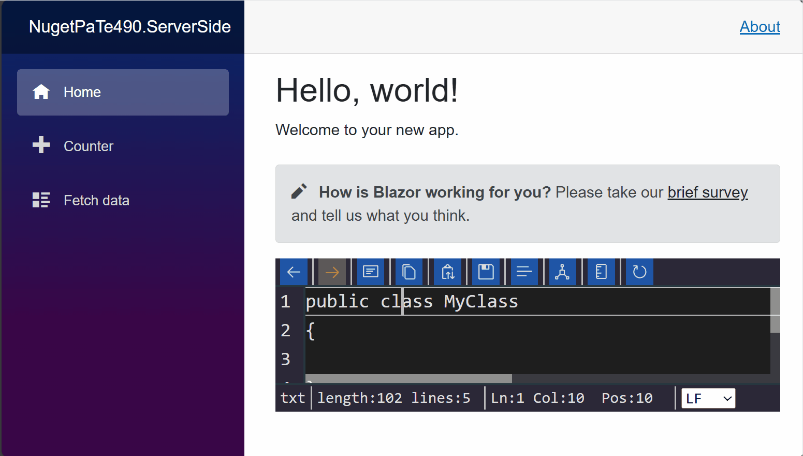

# Luthetus.TextEditor (v4.9.0)

## Usage

### Source Code
The .NET Solution: [Luthetus.Tutorials.sln](../../Source/Tutorials/Luthetus.Tutorials.sln),
was made by following steps described here. So, the completed result can be found there.

### Goal


- Render a C# Text Editor which makes use of the CSharpCompilerService

### Previous tutorial: [installation.md](./installation.md)

### Steps
- Create a codebehind for the file: `Pages/Index.razor`

```csharp
// Pages/Index.razor.cs

using Microsoft.AspNetCore.Components;

namespace Luthetus.Tutorials.RazorLib.Pages;

public partial class Index : ComponentBase
{
}
```

- There are 2 parts to rendering a Text Editor.

- First, one needs to make a [TextEditorModel](/Source/Lib/TextEditor/TextEditors/Models/TextEditorModel.cs).

- Then, one needs to make a [TextEditorViewModel](/Source/Lib/TextEditor/TextEditors/Models/TextEditorViewModel.cs) for that previously made `model`.

- In Index.razor.cs add the following line of code:

```csharp
// using Luthetus.TextEditor.RazorLib.Lexers.Models;
public static ResourceUri ResourceUri { get; } = new("/index.txt");
```

- The [ResourceUri](/Source/Lib/TextEditor/Lexers/Models/ResourceUri.cs) is a unique identifier for a given `TextEditorModel`.

- One might think of a `TextEditorModel` as mapping to a file on their filesystem, as an example.

- Override the Blazor lifecycle method named: `OnInitialized()`

```csharp
protected override void OnInitialized()
{
    base.OnInitialized();
}
```

- Inside this override we can register the `TextEditorModel`.

- We need access to the [ITextEditorService](/Source/Lib/TextEditor/ITextEditorService.cs) to register a `TextEditorModel`. So, inject the `ITextEditorService`.

```csharp
// using Luthetus.TextEditor.RazorLib;
[Inject]
private ITextEditorService TextEditorService { get; set; } = null!;
```

- The `ITextEditorService` has public properties that encapsulate the API for a given datatype in the `Luthetus.TextEditor` namespace. For example, `TextEditorService.ModelApi` accesses the `ModelApi` property, which has all of the API related to the `TextEditorModel` datatype.

- By invoking `TextEditorService.ModelApi.RegisterCustom(...);`, we can register a TextEditorModel. The `RegisterCustom(...)` method takes as parameters: an instance of [TextEditorEditContext](https://github.com/Luthetus/Luthetus.Ide/blob/main/Source/Lib/TextEditor/TextEditorEditContext.cs#L9), and a `TextEditorModel`. So we need to make the `TextEditorModel` instance.

- In the override for `OnInitialized()`, create an instance of a `TextEditorModel`.

```csharp
// using Luthetus.TextEditor.RazorLib.TextEditors.Models;
var model = new TextEditorModel(
	ResourceUri,
	DateTime.UtcNow,
	ExtensionNoPeriodFacts.TXT,
	"public class MyClass\n{\n\t\n}\n",
	decorationMapper: null,
	compilerService: null);
```

- Now, we need the `TextEditorEditContext`. Invoke `TextEditorService.WorkerArbitrary.PostUnique(...)`. The first argument is a "name" for the work item. The second argument is a Func that will provide you a `TextEditorEditContext` instance, and expects you to return a `ValueTask`.

- Inside the `TextEditorService.WorkerArbitrary.PostUnique(...)` Func argument, go on to in the body of the Func, invoke `TextEditorService.Model.RegisterCustom(...)`. Pass the `TextEditorEditContext` that the Func provided, and the instance of the `TextEditorModel`.

```csharp
protected override void OnInitialized()
{
	// using Luthetus.TextEditor.RazorLib.TextEditors.Models;
    var model = new TextEditorModel(
		ResourceUri,
		DateTime.UtcNow,
		ExtensionNoPeriodFacts.TXT,
		"public class MyClass\n{\n\t\n}\n",
	    decorationMapper: null,
        compilerService: null);

	TextEditorService.WorkerArbitrary.PostUnique(nameof(Index), editContext =>
	{
    	TextEditorService.ModelApi.RegisterCustom(editContext, model);
		return ValueTask.CompletedTask;
	});

    base.OnInitialized();
}
```

- In order to render a `TextEditorModel`, we need a [TextEditorViewModel](/Source/Lib/TextEditor/TextEditors/Models/TextEditorViewModel.cs). A file on one's operating system would relate to a `model`. Whereas, an open text editor would relate to a `viewModel`.

- Many `TextEditorViewModel` can reference an underlying `TextEditorModel`. But, only 1 `model` for a given file on one's operating system can exist.

> *NOTE:* I used a file system as an example but, a TextEditorModel can be made "out of thin air" just the same.

- We need a TextEditorViewModelKey so we can maintain the TextEditorViewModel state between page changes.

- Add the following line of code:

```csharp
// using Luthetus.Common.RazorLib.Keys.Models;
public static Key<TextEditorViewModel> ViewModelKey { get; } = Key<TextEditorViewModel>.NewKey();
```

- Now, inside the `TextEditorService.WorkerArbitrary.PostUnique(...)` Func argument, invoke `TextEditorService.ViewModelApi.Register(...)` after the line that you registered the model.

> *NOTE:* The argument 'Category' to 'TextEditorService.ViewModelApi.Register(...)' can be passed as 'new Category("main")'. It acts only as a way to filter a list of view models.

```csharp
TextEditorService.ViewModelApi.Register(
    editContext,
    ViewModelKey,
    ResourceUri,
    new Category("main"));
```

- My `Pages/Index.razor.cs` file as of this step looks as follows:

```csharp
using Microsoft.AspNetCore.Components;
using Luthetus.Common.RazorLib.Keys.Models;
using Luthetus.TextEditor.RazorLib;
using Luthetus.TextEditor.RazorLib.Lexers.Models;
using Luthetus.TextEditor.RazorLib.TextEditors.Models;

namespace NugetPaTe490.ServerSide.Pages;

public partial class Index : ComponentBase
{
	[Inject]
	private ITextEditorService TextEditorService { get; set; } = null!;

	public static ResourceUri ResourceUri { get; } = new("/index.txt");
	public static Key<TextEditorViewModel> ViewModelKey { get; } = Key<TextEditorViewModel>.NewKey();
	
	protected override void OnInitialized()
	{
	    var model = new TextEditorModel(
			ResourceUri,
			DateTime.UtcNow,
			ExtensionNoPeriodFacts.TXT,
			"public class MyClass\n{\n\t\n}\n",
		    decorationMapper: null,
	        compilerService: null);
	
		TextEditorService.WorkerArbitrary.PostUnique(nameof(Index), editContext =>
		{
	    	TextEditorService.ModelApi.RegisterCustom(editContext, model);
	    	
	    	TextEditorService.ViewModelApi.Register(
	    		editContext,
			    ViewModelKey,
			    ResourceUri,
			    new Category("main"));
	    	
	    	return ValueTask.CompletedTask;
		});
	
	    base.OnInitialized();
	}
}
```

- In the .razor markup (`Pages/Index.razor`) render the Blazor component:
```html
<!-- @using Luthetus.TextEditor.RazorLib.TextEditors.Displays -->
<TextEditorViewModelDisplay/>
```

- This component takes only one required parameter, any others are for customization.

- The required parameter named `TextEditorViewModelKey` can be given the property named `ViewModelKey`, which was made in the codebehind.

```csharp
@page "/"

@using Luthetus.TextEditor.RazorLib.TextEditors.Displays;

<PageTitle>Index</PageTitle>

<h1>Hello, world!</h1>

Welcome to your new app.

<TextEditorViewModelDisplay TextEditorViewModelKey="ViewModelKey" />
```

- A plain text editor without syntax highlighting should render now when the app is ran.



> Height of the text editor is 100% of the parent element.

> For the Blazor default project template I'll provide a quick hack I did to get things to work, but this only demonstrates the idea of how you'd fix a height issue, not well written CSS.

``` html
<!-- Blazor template: Index.razor -->

@page "/"

@using Luthetus.TextEditor.RazorLib.TextEditors.Displays;

<PageTitle>Index</PageTitle>

<div style="height: 5em;">
	<h1>Hello, world!</h1>
	
	Welcome to your new app.
</div>

@* 10px for padding *@
<div style="height: calc(100% - 5em - 10px);">
	<TextEditorViewModelDisplay TextEditorViewModelKey="ViewModelKey"/>
</div>
```

``` html
<!-- Blazor template: MainLayout.razor -->

@inherits LayoutComponentBase

<PageTitle>Luthetus.Tutorials</PageTitle>

<div class="page">
    <div class="sidebar">
        <NavMenu />
    </div>

    <main>
        <div class="top-row px-4">
            <a href="https://docs.microsoft.com/aspnet/" target="_blank">About</a>
        </div>

        <!-- The change is here, to the style attribute of the article element. 56px is the height of the top-row. -->
        <article class="content px-4" style="height: calc(100% - 56px);">
            @Body
        </article>
    </main>
</div>
```

The following GIF showcases the result of the "Blazor template height hack":


> The text editor automatically detects the user agent resize events and re-renders at a 3 second debounce ([BrowserResizeInterop.cs](/Source/Lib/Common/Dimensions/Models/BrowserResizeInterop.cs)).

- Now we can add in the C# Compiler Service.

- Reference the `Luthetus.CompilerServices.CSharp` Nuget Package

Go to the file that you register your services and locate where you previously added the scoped ICompilerServiceRegistry, and IDecorationMapperRegistry. Instead of using the "default" implementations we can provide our own Type that will implement the interface.

```csharp
/*using Luthetus.TextEditor.RazorLib.CompilerServices.Interfaces;
using Luthetus.TextEditor.RazorLib.Decorations.Models;*/

// NOTE: the next step creates the implementations
services
    .AddScoped<ICompilerServiceRegistry, CompilerServiceRegistry>()
    .AddScoped<IDecorationMapperRegistry, DecorationMapperRegistry>();
```

Add CompilerServiceRegistry.cs as follows:
```csharp
using Luthetus.Common.RazorLib.Clipboards.Models;
using Luthetus.TextEditor.RazorLib;
using Luthetus.TextEditor.RazorLib.CompilerServices;
using Luthetus.TextEditor.RazorLib.TextEditors.Models;
using Luthetus.CompilerServices.CSharp.CompilerServiceCase;

namespace NugetPaTe490.ServerSide;

public class CompilerServiceRegistry : ICompilerServiceRegistry
{
    private readonly Dictionary<string, ICompilerService> _map = new();

    public IReadOnlyList<ICompilerService> CompilerServiceList => _map.Values.ToList();

    public CompilerServiceRegistry(ITextEditorService textEditorService, IClipboardService clipboardService)
    {
        CSharpCompilerService = new CSharpCompilerService(textEditorService, clipboardService);
        DefaultCompilerService = new CompilerServiceDoNothing();
        
        _map.Add(ExtensionNoPeriodFacts.C_SHARP_CLASS, CSharpCompilerService);
    }

    public CSharpCompilerService CSharpCompilerService { get; }
    public CompilerServiceDoNothing DefaultCompilerService { get; }

    public ICompilerService GetCompilerService(string extensionNoPeriod)
    {
        if (_map.TryGetValue(extensionNoPeriod, out var compilerService))
            return compilerService;

        return DefaultCompilerService;
    }
}

```

Add DecorationMapperRegistry.cs as follows:
```csharp
using Luthetus.TextEditor.RazorLib.Decorations.Models;
using Luthetus.TextEditor.RazorLib.TextEditors.Models;

namespace NugetPaTe490.ServerSide;

public class DecorationMapperRegistry : IDecorationMapperRegistry
{
    private Dictionary<string, IDecorationMapper> _map { get; } = new();

    public DecorationMapperRegistry()
    {
        GenericDecorationMapper = new GenericDecorationMapper();
        DefaultDecorationMapper = new TextEditorDecorationMapperDefault();

        _map.Add(ExtensionNoPeriodFacts.C_SHARP_CLASS, GenericDecorationMapper);
    }

    public GenericDecorationMapper GenericDecorationMapper { get; }
    public TextEditorDecorationMapperDefault DefaultDecorationMapper { get; }

    public IDecorationMapper GetDecorationMapper(string extensionNoPeriod)
    {
        if (_map.TryGetValue(extensionNoPeriod, out var decorationMapper))
            return decorationMapper;

        return DefaultDecorationMapper;
    }
}
```

- In the `Pages/Index.razor.cs` file we now can provide the `CSharpCompilerService` when instantiating a `TextEditorModel`.

- Inject the `ICompilerServiceRegistry` and the `IDecorationMapperRegistry`

```csharp
/*using Luthetus.TextEditor.RazorLib.CompilerServices;
using Luthetus.TextEditor.RazorLib.Decorations.Models;*/

[Inject]
private ICompilerServiceRegistry CompilerServiceRegistry { get; set; } = null!;
[Inject]
private IDecorationMapperRegistry DecorationMapperRegistry { get; set; } = null!;
```

- In `OnInitialized()`, prior to constructing the `TextEditorModel` we can get the decoration mapper, and compiler service we wish to use.

```csharp
var genericDecorationMapper = DecorationMapperRegistry.GetDecorationMapper(
    ExtensionNoPeriodFacts.C_SHARP_CLASS);

var cSharpCompilerService = CompilerServiceRegistry.GetCompilerService(
    ExtensionNoPeriodFacts.C_SHARP_CLASS);
```

- Then pass in `genericDecorationMapper` and `cSharpCompilerService` instead of the nulls when invoking the `TextEditorModel` constructor.

- One last step, on the line immediately following, `TextEditorService.ModelApi.RegisterCustom(editContext, model);` add the line: `cSharpCompilerService.RegisterResource(model.ResourceUri, shouldTriggerResourceWasModified: true);`

- My `Pages/Index.razor.cs` file as of this step is shown in the following code snippet:

```csharp
using Microsoft.AspNetCore.Components;
using Luthetus.Common.RazorLib.Keys.Models;
using Luthetus.TextEditor.RazorLib;
using Luthetus.TextEditor.RazorLib.Lexers.Models;
using Luthetus.TextEditor.RazorLib.TextEditors.Models;
using Luthetus.TextEditor.RazorLib.CompilerServices;
using Luthetus.TextEditor.RazorLib.Decorations.Models;

namespace NugetPaTe490.ServerSide.Pages;

public partial class Index : ComponentBase
{
	[Inject]
	private ITextEditorService TextEditorService { get; set; } = null!;
	[Inject]
	private ICompilerServiceRegistry CompilerServiceRegistry { get; set; } = null!;
	[Inject]
	private IDecorationMapperRegistry DecorationMapperRegistry { get; set; } = null!;

	public static ResourceUri ResourceUri { get; } = new("/index.txt");
	public static Key<TextEditorViewModel> ViewModelKey { get; } = Key<TextEditorViewModel>.NewKey();
	
	protected override void OnInitialized()
	{
		var genericDecorationMapper = DecorationMapperRegistry.GetDecorationMapper(
		    ExtensionNoPeriodFacts.C_SHARP_CLASS);
		
		var cSharpCompilerService = CompilerServiceRegistry.GetCompilerService(
		    ExtensionNoPeriodFacts.C_SHARP_CLASS);
		
	    var model = new TextEditorModel(
			ResourceUri,
			DateTime.UtcNow,
			ExtensionNoPeriodFacts.TXT,
			"public class MyClass\n{\n\t\n}\n",
		    genericDecorationMapper,
	        cSharpCompilerService);
	
		TextEditorService.WorkerArbitrary.PostUnique(nameof(Index), editContext =>
		{
	    	TextEditorService.ModelApi.RegisterCustom(editContext, model);
	    	cSharpCompilerService.RegisterResource(model.ResourceUri, shouldTriggerResourceWasModified: true);
	    	
	    	TextEditorService.ViewModelApi.Register(
	    		editContext,
			    ViewModelKey,
			    ResourceUri,
			    new Category("main"));
	    	
	    	return ValueTask.CompletedTask;
		});
	
	    base.OnInitialized();
	}
}
```

- Now you should have a Text Editor with the CSharpCompilerService as shown in this GIF:


- I followed this tutorial myself, and a mistake I made was that I never changed the "default" registry implementations -- I only made the classes. After fixing this, my service registrations look like the following:
```csharp
using Microsoft.AspNetCore.Components;
using Microsoft.AspNetCore.Components.Web;
using NugetPaTe490.ServerSide;
using NugetPaTe490.ServerSide.Data;
using Luthetus.Common.RazorLib.Installations.Models;
using Luthetus.Common.RazorLib.BackgroundTasks.Models;
using Luthetus.TextEditor.RazorLib.Installations.Models;
using Luthetus.TextEditor.RazorLib.CompilerServices;
using Luthetus.TextEditor.RazorLib.Decorations.Models;

var builder = WebApplication.CreateBuilder(args);

var luthetusHostingKind = LuthetusHostingKind.ServerSide;

var hostingInformation = new LuthetusHostingInformation(
    luthetusHostingKind,
    LuthetusPurposeKind.TextEditor,
    new BackgroundTaskService());

builder.Services.AddLuthetusTextEditor(hostingInformation);

builder.Services
    .AddScoped<ICompilerServiceRegistry, CompilerServiceRegistry>()
    .AddScoped<IDecorationMapperRegistry, DecorationMapperRegistry>();
```

# Next tutorial: #TODO: Continue