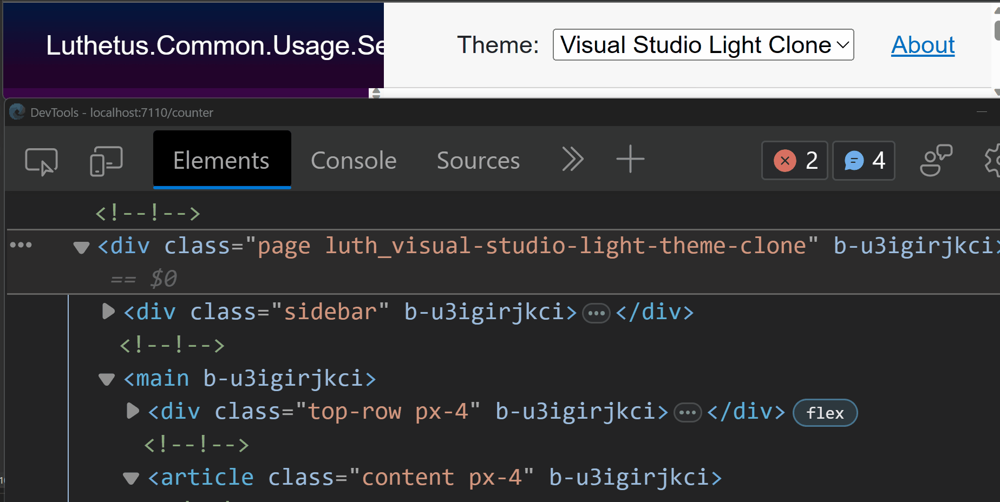
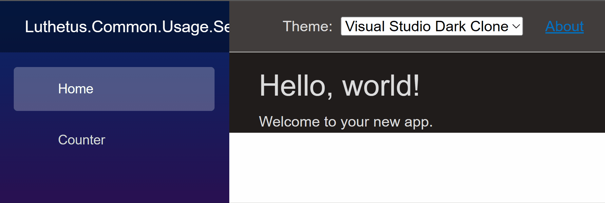

# Luthetus.Common (v1.3.0)

## Usage

### Source Code
The .NET Solution: [Luthetus.Common.Usage.sln](../Source/Tutorials/Usage/Luthetus.Common.Usage.sln),
was made by following steps described here. So, the completed result can be found there.

### Goal

- Add the `Light and Dark theme`

### Steps
- Create a codebehind for the file: `Shared/MainLayout.razor`

> *NOTE:* In many C# Project templates, `Shared/MainLayout.razor` inherits from `LayoutComponentBase` instead of `ComponentBase`.

```csharp
// Shared/MainLayout.razor.cs

using Microsoft.AspNetCore.Components;

namespace Luthetus.Common.Usage.RazorLib.Shared;

public partial class MainLayout : LayoutComponentBase
{
}
```

- Inject the `IAppOptionsService` interface.

```csharp
[Inject]
private IAppOptionsService AppOptionsService { get; set; } = null!;
```

- We need to subscribe to the state changes of the IAppOptionsService.

- When subscribing to an event. It is possible to create a memory leak, if one does not unsubscribe from the event at a later point.

- For this reason, I'll perform the steps in an order that ensures my code will not compile if I forget to unsubscribe.

- Have `MainLayout` implement the interface: `IDisposable`.

- Then using a refactor, one can autocomplete the method definition for `void Dispose()`.

- At this step, here is the entirety of my `Shared/MainLayout.razor.cs`

```csharp
using Luthetus.Common.RazorLib.Options.Models;
using Microsoft.AspNetCore.Components;

namespace Luthetus.Common.Usage.RazorLib.Shared;

public partial class MainLayout : LayoutComponentBase, IDisposable
{
    [Inject]
    private IAppOptionsService AppOptionsService { get; set; } = null!;

    public void Dispose()
    {
        throw new NotImplementedException();
    }
}
```

- Replace the contents of the `Dispose()` method with `replaceAppOptionsService.AppOptionsStateWrap.StateChanged -= ;`. It looks as follows for me:

```csharp
public void Dispose()
{
    AppOptionsService.AppOptionsStateWrap.StateChanged -= ;
}
```

- Override the Blazor lifecycle method named `OnInitialized()`. See this code snippet:

```csharp
protected override void OnInitialized()
{
    base.OnInitialized();
}
```

- In `OnInitialized()` we can subscribe to the `AppOptionsService` state changes.

- Add into the method override for `OnInitialized()`, above the `base.OnInitialized();`, this line of code: `AppOptionsService.AppOptionsStateWrap.StateChanged += AppOptionsStateWrap_StateChanged;`.

```csharp
protected override void OnInitialized()
{
    AppOptionsService.AppOptionsStateWrap.StateChanged += AppOptionsStateWrap_StateChanged;

    base.OnInitialized();
}
```

> *NOTE:* When I was typing out the previously shown line of code, when I typed the `+=` part and hit `space`, I was prompted by Visual Studio to hit `tab` to autocomplete out an EventHandler.

```csharp
private void AppOptionsStateWrap_StateChanged(object? sender, EventArgs e)
{
    throw new NotImplementedException();
}
```

- Now that we have the subscription occurring in the `OnInitialized()`, we can go back to the `Dispose()` implementation. We had left out the right hand side of the unsubscribe statement. Replace that line with this: `AppOptionsService.AppOptionsStateWrap.StateChanged -= AppOptionsStateWrap_StateChanged;`. Now the code will compile again. My code snippet for `MainLayout.razor.cs` is shown here:

```csharp
using Luthetus.Common.RazorLib.Options.Models;
using Microsoft.AspNetCore.Components;

namespace Luthetus.Common.Usage.RazorLib.Shared;

public partial class MainLayout : LayoutComponentBase, IDisposable
{
    [Inject]
    private IAppOptionsService AppOptionsService { get; set; } = null!;

    protected override void OnInitialized()
    {
        AppOptionsService.AppOptionsStateWrap.StateChanged += AppOptionsStateWrap_StateChanged;

        base.OnInitialized();
    }

    private void AppOptionsStateWrap_StateChanged(object? sender, EventArgs e)
    {
        throw new NotImplementedException();
    }

    public void Dispose()
    {
        AppOptionsService.AppOptionsStateWrap.StateChanged -= AppOptionsStateWrap_StateChanged;
    }
}
```

- We need to re-render the component anytime that the AppOptionsState has its state change. So, the `AppOptionsStateWrap_StateChanged()` method needs to be changed.

- Make the `AppOptionsStateWrap_StateChanged()` method `async`. But keep `void`, since it is being used as an EventHandler.

Within the body for `AppOptionsStateWrap_StateChanged()`, put this line of code: `await InvokeAsync(StateHasChanged);`.

In total, my `AppOptionsStateWrap_StateChanged()` method looks as follows:

```csharp
private async void AppOptionsStateWrap_StateChanged(object? sender, EventArgs e)
{
    await InvokeAsync(StateHasChanged);
}
```

- I want a &lt;`select`&gt; HTML element where the options are the various themes that one can choose.

- `Shared/MainLayout.razor` has a &lt;`div`&gt; HTML element with the css class: `top-row`. Inside this HTML element I will be putting the &lt;`select`&gt; HTML element.

- This &lt;`select`&gt; HTML element already exists within the Luthetus.Common NuGet Package. Inside the previously described &lt;`div`&gt; add the markup: `<Luthetus.Common.RazorLib.Options.Displays.InputAppTheme />` as shown in the following snippet:

```html
<!-- MainLayout.razor -->

@inherits LayoutComponentBase

<PageTitle>Luthetus.Common.Usage.ServerSide</PageTitle>

<Luthetus.Common.RazorLib.Installations.Displays.LuthetusCommonInitializer/>

<div class="page">
    <div class="sidebar">
        <NavMenu />
    </div>

    <main>
        <div class="top-row px-4">
            <!-- Here -->
            <Luthetus.Common.RazorLib.Options.Displays.InputAppTheme />
            <a href="https://docs.microsoft.com/aspnet/" target="_blank">About</a>
        </div>

        <article class="content px-4">
            @Body
        </article>
    </main>
</div>
```

Here is a quick GIF as well that shows how the website looks as of this step:


- When I change my selection in the `<Luthetus.Common.RazorLib.Options.Displays.InputAppTheme />`, I want the corresponding CSS class to be applied to the top-most &lt;div&gt; in `MainLayout.razor`. This would then allow me to cascade a color theme to child elements.

- In `MainLayout.razor`, we need to locate the top-most &lt;div&gt;. Following that, we need to interpolate the css class which corresponds to the selected theme. I changed my top-most element's `class` property to `class="page @AppOptionsService.ThemeCssClassString"`. The following is the entirety of my `MainLayout.razor`:

```html
<!-- MainLayout.razor -->

@inherits LayoutComponentBase

<PageTitle>Luthetus.Common.Usage.ServerSide</PageTitle>

<Luthetus.Common.RazorLib.Installations.Displays.LuthetusCommonInitializer/>

<div class="page @AppOptionsService.ThemeCssClassString">
    <div class="sidebar">
        <NavMenu />
    </div>

    <main>
        <div class="top-row px-4">
            <Luthetus.Common.RazorLib.Options.Displays.InputAppTheme />
            <a href="https://docs.microsoft.com/aspnet/" target="_blank">About</a>
        </div>

        <article class="content px-4">
            @Body
        </article>
    </main>
</div>
```

The following GIF has open the browser's developer tools, while changing the selected theme. This shows that we are updating the `class` property correctly.



- Now we need to actually use the `CSS variables` which are defined in `luthetusCommon.css`

In the upcoming GIF I am going to show two ways that one can see all the `CSS variables` which are available from `luthetusCommon.css`.

> *NOTE:* This GIF is 2 minutes and 41 seconds long. #TODO: shorten the length of this GIF.


- Inside `MainLayout.razor.css` add the following code snippet:

```css
div.top-row {
    background-color: var(--luth_tertiary-background-color);
    color: var(--luth_tertiary-foreground-color);
}

article.content {
    background-color: var(--luth_primary-background-color);
    color: var(--luth_primary-foreground-color);
}
```

- Now when we change the theme, parts of the website that use the CSS variables will change. See the following GIF:



# Next tutorial: #TODO: Continue