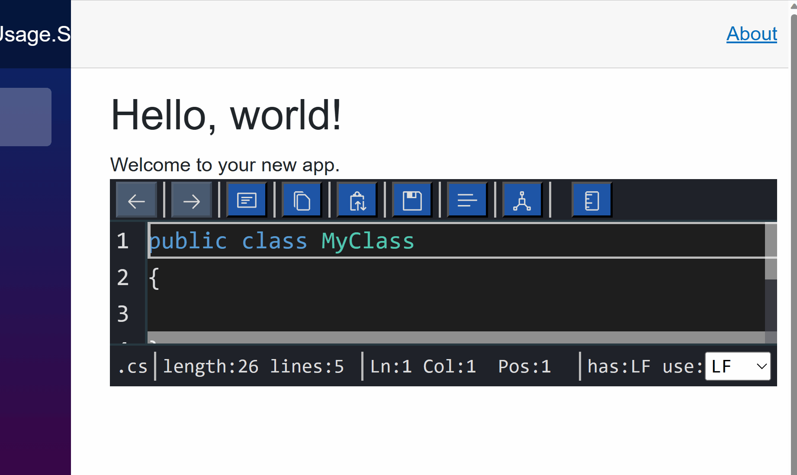

# Luthetus.TextEditor (v1.3.0)

## Usage

### Source Code
The .NET Solution: [Luthetus.TextEditor.Usage.sln](../Source/Tutorials/Usage/Luthetus.TextEditor.Usage.sln),
was made by following steps described here. So, the completed result can be found there.

### Goal

- Render a C# Text Editor which makes use of the CSharpCompilerService



### Steps
- Create a codebehind for the file: `Pages/Index.razor`

```csharp
// Pages/Index.razor.cs

using Microsoft.AspNetCore.Components;

namespace Luthetus.TextEditor.Usage.RazorLib.Pages;

public partial class Index : ComponentBase
{
}
```

- There are 2 parts to rendering a Text Editor.

- First, one needs to make a `TextEditorModel`.

- Then, one needs to make a `TextEditorViewModel` for that previously made `TextEditorModel`.

- In Index.razor.cs add the following line of code:

```csharp
private static readonly TextEditorModelKey IndexTextEditorModelKey = TextEditorModelKey.NewTextEditorModelKey();
```

- The `TextEditorModelKey` is a unique identifier for a given `TextEditorModel`.

- Override the Blazor lifecycle method named: `OnInitialized()`

```csharp
protected override void OnInitialized()
{
    base.OnInitialized();
}
```

- Inside this override, and above the `base.OnInitialized();` invocation, we can register the `TextEditorModel`.

- We need access to the `ITextEditorService` to register a `TextEditorModel`. So, inject the `ITextEditorService`.

```csharp
[Inject]
private ITextEditorService TextEditorService { get; set; } = null!;
```

- The `ITextEditorService` has public properties that encapsulate the API for a given datatype in the `Luthetus.TextEditor` namespace. For example, `TextEditorService.Model` accesses the `Model` property, which has all of the API related to the `TextEditorModel` datatype.

- By invoking `TextEditorService.Model.RegisterCustom(...);`, we can create register a TextEditorModel. The `RegisterCustom(...)` method takes as a parameter an instance of `TextEditorModel`. So we need to make that instance.

- In the override for `OnInitialized()`, create an instance of a `TextEditorModel`. The, pass it in to the `TextEditorService.Model.RegisterCustom(...)` invocation.

```csharp
protected override void OnInitialized()
{
    var textEditorModel = new TextEditorModel(
        new ResourceUri("uniqueIdentifierGoesHere.cs"),
        DateTime.UtcNow,
        ".cs",
        "public class MyClass\n{\n\n}\n",
        new TextEditorDefaultCompilerService(),
        new GenericDecorationMapper(),
        null,
        new(),
        IndexTextEditorModelKey);

    TextEditorService.Model.RegisterCustom(textEditorModel);

    base.OnInitialized();
}
```

- In order to render a `TextEditorModel`, we need a `TextEditorViewModel`. A file on one's operating system would relate to a `TextEditorModel`. Whereas, an open text editor would relate to a `TextEditorViewModel`.

- Many `TextEditorViewModel` can reference an underlying `TextEditorModel`. But, only 1 `TextEditorModel` for a given file on one's operating system can exist.

> *NOTE:* I use an example of a operating system's file system but, it is just an example, one can make a TextEditorModel out of "thin air" if they'd like to.

- We need a TextEditorViewModelKey so we can maintain the TextEditorViewModel state between page changes.

- Add the following line of code:

```csharp
private static readonly TextEditorViewModelKey IndexTextEditorViewModelKey = TextEditorViewModelKey.NewTextEditorViewModelKey();
```

- Now, in the override for `OnInitialized()`, invoke `TextEditorService.ViewModel.Register(...)`.

```csharp
TextEditorService.ViewModel.Register(
    IndexTextEditorViewModelKey,
    IndexTextEditorModelKey);
```

- My `Pages/Index.razor.cs` file as of this step looks as follows:

```csharp
using Luthetus.TextEditor.RazorLib;
using Luthetus.TextEditor.RazorLib.CompilerServiceCase;
using Luthetus.TextEditor.RazorLib.CompilerServiceCase.GenericLexer.Decoration;
using Luthetus.TextEditor.RazorLib.Lexing;
using Luthetus.TextEditor.RazorLib.Model;
using Luthetus.TextEditor.RazorLib.ViewModel;
using Microsoft.AspNetCore.Components;

namespace Luthetus.TextEditor.Usage.RazorLib.Pages;

public partial class Index : ComponentBase
{
    [Inject]
    private ITextEditorService TextEditorService { get; set; } = null!;

    private static readonly TextEditorModelKey IndexTextEditorModelKey = TextEditorModelKey.NewTextEditorModelKey();
    private static readonly TextEditorViewModelKey IndexTextEditorViewModelKey = TextEditorViewModelKey.NewTextEditorViewModelKey();

    protected override void OnInitialized()
    {
        var textEditorModel = new TextEditorModel(
            new ResourceUri("uniqueIdentifierGoesHere.cs"),
            DateTime.UtcNow,
            ".cs",
            "public class MyClass\n{\n\n}\n",
            new TextEditorDefaultCompilerService(),
            new GenericDecorationMapper(),
            null,
            new(),
            IndexTextEditorModelKey);

        TextEditorService.Model.RegisterCustom(textEditorModel);

        TextEditorService.ViewModel.Register(
            IndexTextEditorViewModelKey,
            IndexTextEditorModelKey);

        base.OnInitialized();
    }
}
```

- In the .razor markup (`Pages/Index.razor`) render the Blazor component: `<Luthetus.TextEditor.RazorLib.ViewModel.TextEditorViewModelDisplay/>`

- This component takes various parameters, but only one of them is required. The rest of the parameters are for customization.

- Pass in the required parameter `TextEditorViewModelKey` to have the value of `IndexTextEditorViewModelKey`.

```csharp
@page "/"
@using Luthetus.TextEditor.RazorLib.ViewModel

<PageTitle>Index</PageTitle>

<h1>Hello, world!</h1>

Welcome to your new app.

<TextEditorViewModelDisplay TextEditorViewModelKey="IndexTextEditorViewModelKey"/>
```

- The following GIF shows how the Text Editor looks at this step.


- Now we can add in the C# Compiler Service.

- Reference the `Luthetus.CompilerServices.CSharp` Nuget Package

Go to the file that you register your services and add the following lines of C# code.

> *NOTE:* In many C# Project templates, the services are registered in `Program.cs`.

```csharp
using Luthetus.CompilerServices.Lang.CSharp.CompilerServiceCase;

services.AddScoped<CSharpCompilerService>();
```

- In the `Pages/Index.razor.cs` file we now can provide the `CSharpCompilerService` when instantiating a `TextEditorModel`.

- Inject the `CSharpCompilerService`

```csharp
[Inject]
private CSharpCompilerService CSharpCompilerService { get; set; } = null!;
```

- Then pass in `CSharpCompilerService` instead of `new TextEditorDefaultCompilerService()` when invoking the `TextEditorModel` constructor.

- One last step, on the line immediately following, `TextEditorService.Model.RegisterCustom(textEditorModel);` add the line: `CSharpCompilerService.RegisterModel(textEditorModel);`

- My `Pages/Index.razor.cs` file as of this step is shown in the following code snippet:

```csharp
using Luthetus.CompilerServices.Lang.CSharp.CompilerServiceCase;
using Luthetus.TextEditor.RazorLib;
using Luthetus.TextEditor.RazorLib.CompilerServiceCase;
using Luthetus.TextEditor.RazorLib.CompilerServiceCase.GenericLexer.Decoration;
using Luthetus.TextEditor.RazorLib.Lexing;
using Luthetus.TextEditor.RazorLib.Model;
using Luthetus.TextEditor.RazorLib.ViewModel;
using Microsoft.AspNetCore.Components;

namespace Luthetus.TextEditor.Usage.RazorLib.Pages;

public partial class Index : ComponentBase
{
    [Inject]
    private ITextEditorService TextEditorService { get; set; } = null!;
    [Inject]
    private CSharpCompilerService CSharpCompilerService { get; set; } = null!;

    private static readonly TextEditorModelKey IndexTextEditorModelKey = TextEditorModelKey.NewTextEditorModelKey();
    private static readonly TextEditorViewModelKey IndexTextEditorViewModelKey = TextEditorViewModelKey.NewTextEditorViewModelKey();

    protected override void OnInitialized()
    {
        var textEditorModel = new TextEditorModel(
            new ResourceUri("uniqueIdentifierGoesHere.cs"),
            DateTime.UtcNow,
            ".cs",
            "public class MyClass\n{\n\n}\n",
            CSharpCompilerService,
            new GenericDecorationMapper(),
            null,
            new(),
            IndexTextEditorModelKey);

        TextEditorService.Model.RegisterCustom(textEditorModel);

        CSharpCompilerService.RegisterModel(textEditorModel);

        TextEditorService.ViewModel.Register(
            IndexTextEditorViewModelKey,
            IndexTextEditorModelKey);

        base.OnInitialized();
    }
}
```

- Now you should have a Text Editor with the CSharpCompilerService as shown in this GIF:


# Next tutorial: #TODO: Continue