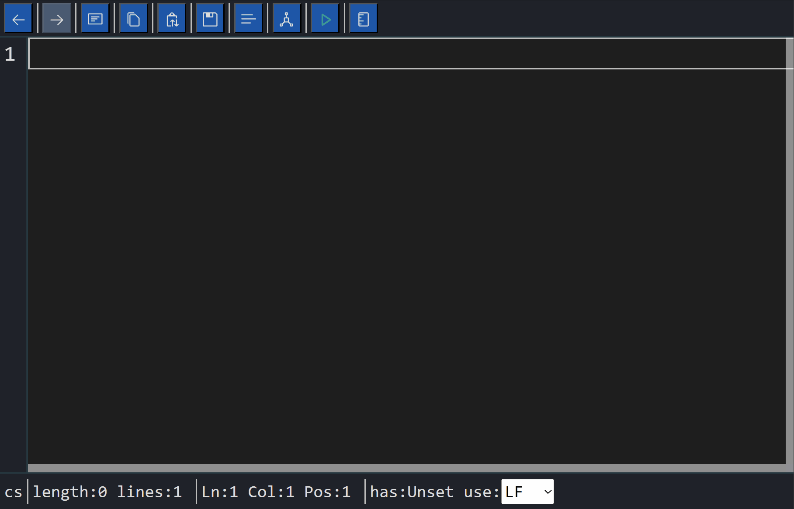

# Luthetus.TextEditor

## Demo:
https://luthetus.github.io/Luthetus.Website/

## Introduction

***Luthetus.TextEditor*** is a Text Editor component library using
the [Blazor UI Framework](https://dotnet.microsoft.com/en-us/apps/aspnet/web-apps/blazor)
for [.NET](https://dotnet.microsoft.com/)

## Goal

The aim of Luthetus.TextEditor is to replicate the features of
the [Monaco Editor](https://microsoft.github.io/monaco-editor/) that
powers [Visual Studio Code](https://code.visualstudio.com/) using Blazor.

One can make use of this Text Editor by referencing the Nuget Package or cloning the source code and referencing it
directly.

## Getting started

- Video format: #TODO: Video
- Markdown format: [installation.md](./Docs/installation.md)

## Installation

You can download the latest release NuGet packages from the official Luthetus.TextEditor NuGet pages.

- https://www.nuget.org/packages/Luthetus.TextEditor/

## Features

- [Vim Emulation](./Docs/Features/Keymap-Vim_TextEditor.md)
- [IndentLess](./Docs/Features/Command-IndentLess_TextEditor.md)
- [IndentMore](./Docs/Features/Command-IndentMore_TextEditor.md)
- [NewLineAbove](./Docs/Features/Command-NewLineAbove_TextEditor.md)
- [NewLineBelow](./Docs/Features/Command-NewLineBelow_TextEditor.md)
- [Paste](./Docs/Features/Command-Paste_TextEditor.md)
- [Redo](./Docs/Features/Command-Redo_TextEditor.md)
- [Remeasure](./Docs/Features/Command-Remeasure_TextEditor.md)
- [Save](./Docs/Features/Command-Save_TextEditor.md)
- [ScrollLineDown](./Docs/Features/Command-ScrollLineDown_TextEditor.md)
- [ScrollLineUp](./Docs/Features/Command-ScrollLineUp_TextEditor.md)
- [ScrollPageDown](./Docs/Features/Command-ScrollPageDown_TextEditor.md)
- [ScrollPageUp](./Docs/Features/Command-ScrollPageUp_TextEditor.md)
- [SelectAll](./Docs/Features/Command-SelectAll_TextEditor.md)
- [ShowFindDialog](./Docs/Features/Command-ShowFindDialog_TextEditor.md)
- [Undo](./Docs/Features/Command-Undo_TextEditor.md)
- [Delete-Text](./Docs/Features/Delete-Text_TextEditor.md)
- [Insert-Text](./Docs/Features/Insert-Text_TextEditor.md)
- [Move-Cursor-With-Keyboard](./Docs/Features/Move-Cursor-With-Keyboard_TextEditor.md)
- [Move-Cursor-With-Mouse](./Docs/Features/Move-Cursor-With-Mouse_TextEditor.md)
- [Select-Text-With-Keyboard](./Docs/Features/Select-Text-With-Keyboard_TextEditor.md)
- [Select-Text-With-Mouse](./Docs/Features/Select-Text-With-Mouse_TextEditor.md)

## Release notes / Changelog

See the [changelog.md](./Docs/changelog.md) for release history.

## Roadmap

See the [roadmap.md](./Docs/roadmap.md) for planned future updates.

# Licence

[MIT](https://opensource.org/licenses/MIT)
