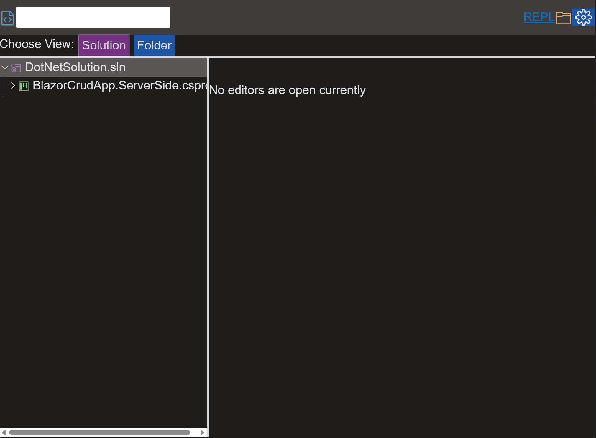
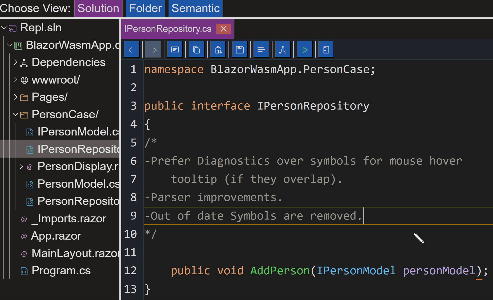
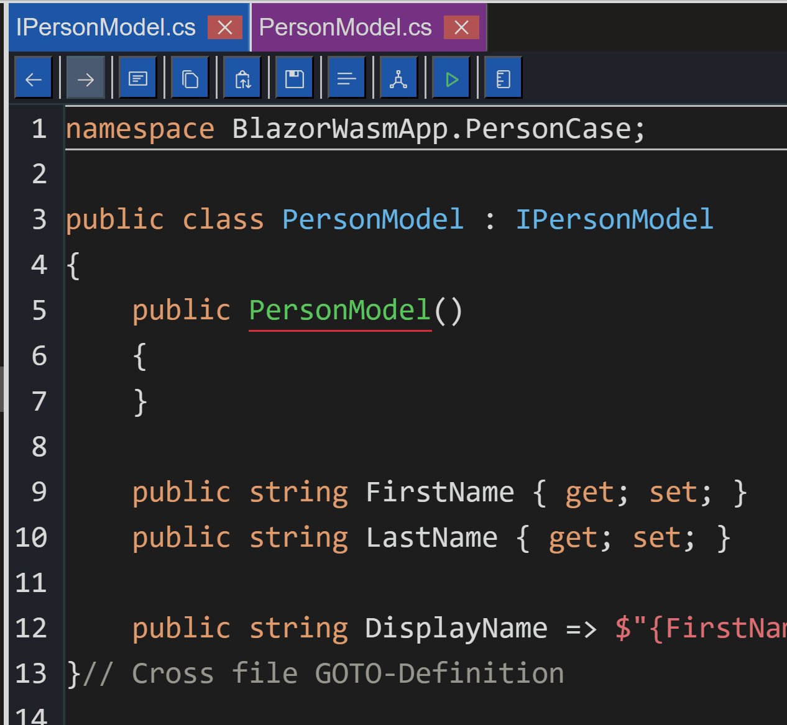
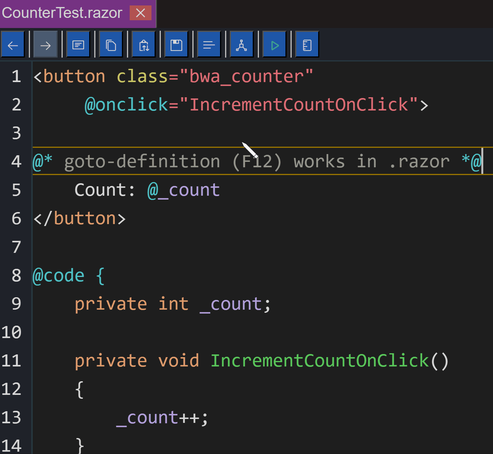
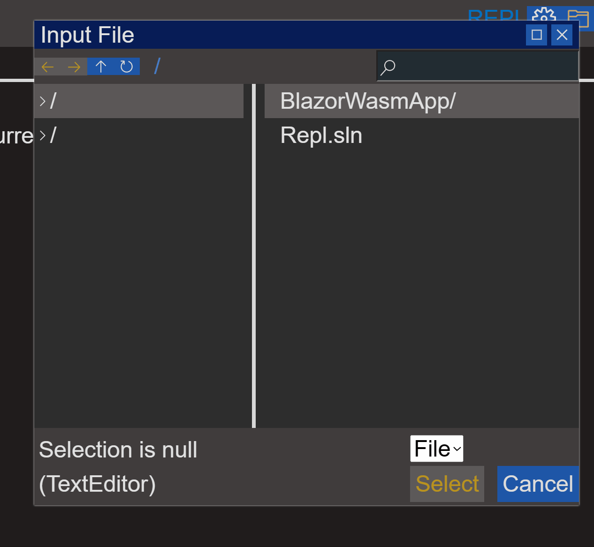
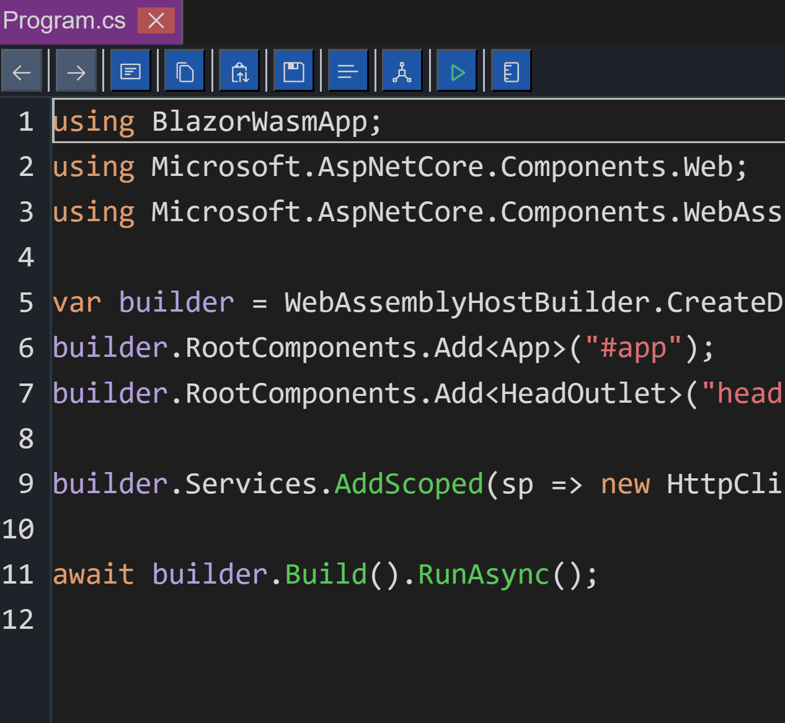
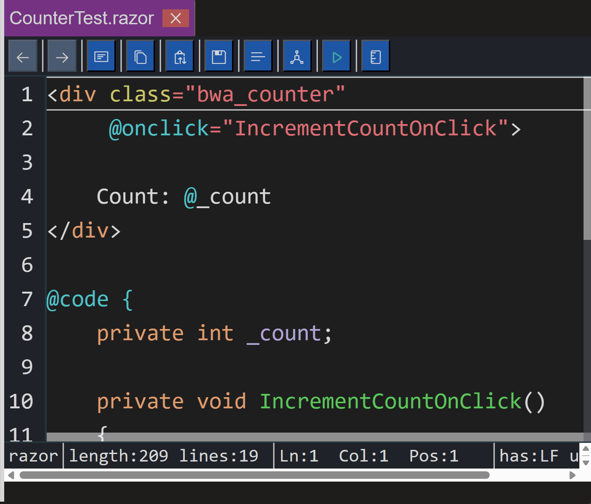
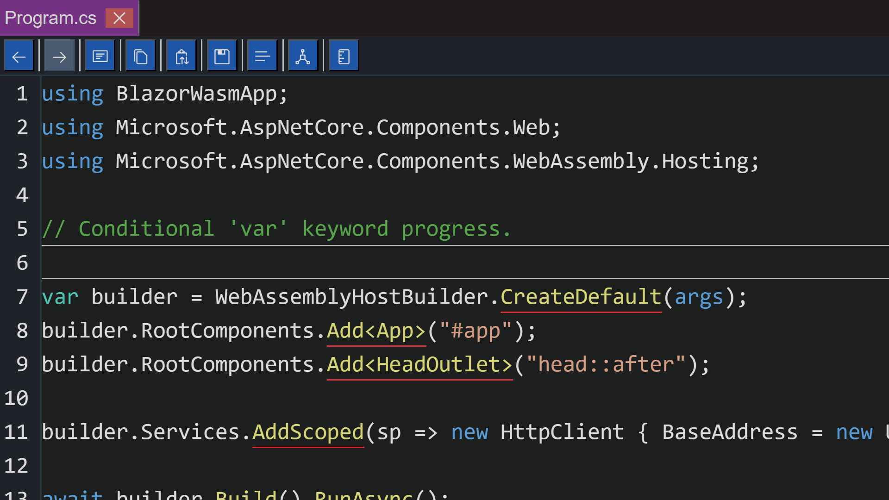

# Luthetus.Website

### One can gauge their interest in the repository with this one minute GIF:

## Demo:
https://luthetus.github.io/Luthetus.Website/

## Recent Changes:

### (2023-06-19) 
-DisplayTracker.cs (namespace: Luthetus.TextEditor.RazorLib.ViewModel). This tracks whether the ViewModel is currently rendered and is expected to be a great improvement to performance.

### (2023-06-11) 
-Many code optimizations were made to allow for the IDE repository run better.

### (2023-06-05) 
-Prefer Diagnostics over symbols for mouse hover tooltip (if they overlap).
-Parser improvements.
-Out of date Symbols are removed.
- 

### (2023-06-04) 
- Semantic Explorer
- 

### (2023-06-03) 
- Cross file go-to definition has been started.
- 

### (2023-06-02) 
- .razor file go-to definition has been started.
- 
- Input file dialog
- 

### (2023-06-01) 
- C# go-to definition has been started. More needs done here, for example cross file goto-definition logic.
- 

### (2023-05-31) 
- Logic added for recognizing Razor attribute directives. Such as @onclick.
- Logic to recognize variables. This logic is currently limited to the variable being declared inside the .razor file.
- Use the C# Compiler Service in .razor files.
- 

### (2023-05-30) 
- Parser improvements for "var contextual keyword"
- Parser improvements for "variable symbol identification"
- 
- BackgroundTaskQueueSingleThreaded was added for the WASM host. This fixes a lot that broke when going from ServerSide to a WASM host. An example being, creation of new files.