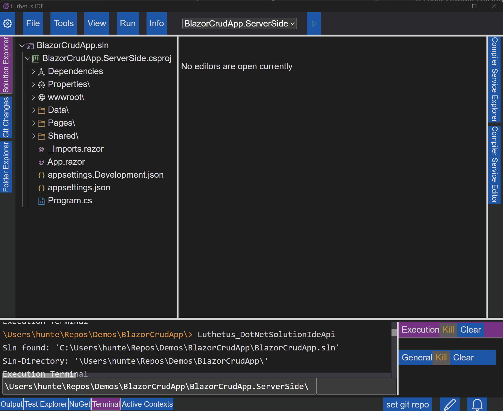
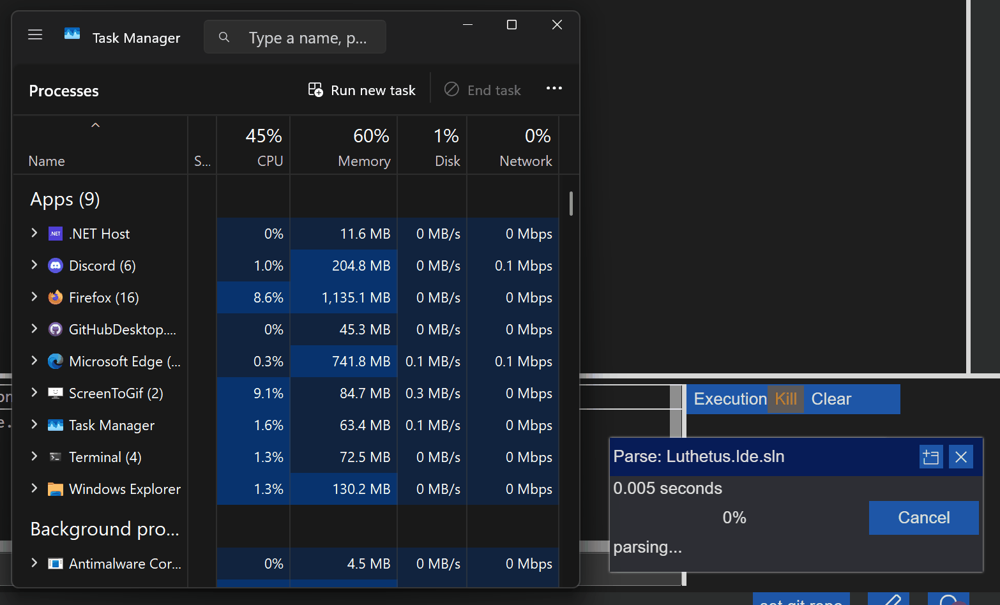

# Luthetus.Ide (In Development)

Make a new .NET Solution:

Edit a file:

Open an existing solution:

Run unit tests:

And there are more features that are not shown in these gifs.

Only 149 MB Memory usage after opening the source code in a published executable of itself and parsing the entire solution with its own - from scratch - C# parser (v0.9.7.43) (1,610 C# files in total parsed in 3.518 seconds.):

## Demo:
https://luthetus.github.io/Luthetus.Ide/

## Installation:
[INSTALLATION.md](./INSTALLATION.md)

## Introduction:

- A free and open source IDE
- Runs on Linux, Windows, and Mac
- Written with the .NET environment: C#, [Blazor UI Framework](https://dotnet.microsoft.com/en-us/apps/aspnet/web-apps/blazor), and a [lightweight Photino webview](https://github.com/tryphotino/photino.Blazor).

The IDE can support any programming language by way of the 'ICompilerService' interface (see links to source code below).

See for example the C# support:
- [CSharpParser.cs](https://github.com/Luthetus/Luthetus.Ide/blob/main/Source/Lib/CompilerServices/CSharp/ParserCase/CSharpParser.cs)
- [CSharpBinder.Main.cs](https://github.com/Luthetus/Luthetus.Ide/blob/main/Source/Lib/CompilerServices/CSharp/BinderCase/CSharpBinder.Main.cs)
- [CSharpBinder.Expressions.cs](https://github.com/Luthetus/Luthetus.Ide/blob/main/Source/Lib/CompilerServices/CSharp/BinderCase/CSharpBinder.Expressions.cs)
- [CSharpCompilerService.cs](https://github.com/Luthetus/Luthetus.Ide/blob/main/Source/Lib/CompilerServices/CSharp/CompilerServiceCase/CSharpCompilerService.cs)
- [CSharpResource.cs](https://github.com/Luthetus/Luthetus.Ide/blob/main/Source/Lib/CompilerServices/CSharp/CompilerServiceCase/CSharpResource.cs)

These are links to the interfaces:
- [IParser.cs](https://github.com/Luthetus/Luthetus.Ide/blob/main/Source/Lib/TextEditor/CompilerServices/Interfaces/IParser.cs)
- [IBinder.cs](https://github.com/Luthetus/Luthetus.Ide/blob/main/Source/Lib/TextEditor/CompilerServices/Interfaces/IBinder.cs)
- [ICompilerService.cs](https://github.com/Luthetus/Luthetus.Ide/blob/main/Source/Lib/TextEditor/CompilerServices/Interfaces/ICompilerService.cs)
- [ICompilerServiceResource.cs](https://github.com/Luthetus/Luthetus.Ide/blob/main/Source/Lib/TextEditor/CompilerServices/Interfaces/ICompilerServiceResource.cs)

One maps a file extension to an ICompilerService with the:
- [ICompilerServiceRegistry.cs](https://github.com/Luthetus/Luthetus.Ide/blob/main/Source/Lib/TextEditor/CompilerServices/Interfaces/ICompilerServiceRegistry.cs)

The colors used for syntax highlighting and presentation are provided with the:
- [IDecorationMapperRegistry.cs](https://github.com/Luthetus/Luthetus.Ide/blob/main/Source/Lib/TextEditor/Decorations/Models/IDecorationMapperRegistry.cs)
- [IDecorationMapper.cs](https://github.com/Luthetus/Luthetus.Ide/blob/main/Source/Lib/TextEditor/Decorations/Models/IDecorationMapper.cs)

## Donations:

## Layout:
NOTE: The prefix 'Luthetus' has been ommitted here from some types for brevity.

Given: &lt;App/&gt;, the '.razor' pseudo code has the following as App's descendent nodes.

- [&lt;CommonInitializer/&gt;](/Source/Lib/Common/Installations/Displays/LuthetusCommonInitializer.razor) | [codebehind](/Source/Lib/Common/Installations/Displays/LuthetusCommonInitializer.razor.cs)
    - override void OnInitialized()
        - AppOptions.SetActiveThemeRecordKey(default);
        - AppOptions.SetFromLocalStorageAsync();
        - AddToContextSwitch(this); // 'Ctrl' + 'Tab' keybind
    - [&lt;DragInitializer/&gt;](/Source/Lib/Common/Drags/Displays/DragInitializer.razor) | [codebehind](/Source/Lib/Common/Drags/Displays/DragInitializer.razor.cs) | [css](/Source/Lib/Common/Drags/Displays/DragInitializer.razor.css)
    - [&lt;DialogInitializer/&gt;](/Source/Lib/Common/Dialogs/Displays/DialogInitializer.razor) | [codebehind](/Source/Lib/Common/Dialogs/Displays/DialogInitializer.razor.cs)
    - [&lt;WidgetInitializer/&gt;](/Source/Lib/Common/Widgets/Displays/WidgetInitializer.razor) | [codebehind](/Source/Lib/Common/Widgets/Displays/WidgetInitializer.razor.cs)
    - [&lt;NotificationInitializer/&gt;](/Source/Lib/Common/Notifications/Displays/NotificationInitializer.razor) | [codebehind](/Source/Lib/Common/Notifications/Displays/NotificationInitializer.razor.cs)
    - [&lt;DropdownInitializer/&gt;](/Source/Lib/Common/Dropdowns/Displays/DropdownInitializer.razor) | [codebehind](/Source/Lib/Common/Dropdowns/Displays/DropdownInitializer.razor.cs)
    - [&lt;OutlineInitializer/&gt;](/Source/Lib/Common/Outlines/Displays/OutlineInitializer.razor) | [codebehind](/Source/Lib/Common/Outlines/Displays/OutlineInitializer.razor.cs) | [css](/Source/Lib/Common/Outlines/Displays/OutlineInitializer.razor.css)
- [&lt;TextEditorInitializer/&gt;](/Source/Lib/TextEditor/Installations/Displays/LuthetusTextEditorInitializer.razor.cs) | only has [codebehind](/Source/Lib/TextEditor/Installations/Displays/LuthetusTextEditorInitializer.razor.cs), no markup
	- override void OnInitialized()
        - EditorOptions.RegisterThemes(customThemeList);
        - EditorOptions.SetActiveThemeRecordKey(default);
        - EditorOptions.SetFromLocalStorageAsync();
        - AddToContextSwitch(this);
	    - RegisterKeymapLayer();
- [&lt;LuthetusIdeInitializer/&gt;](/Source/Lib/Ide/Ide.RazorLib/Installations/Displays/LuthetusIdeInitializer.razor) | [codebehind](/Source/Lib/Ide/Ide.RazorLib/Installations/Displays/LuthetusIdeInitializer.razor.cs)
	- override void OnInitialized()
        - EditorOptions.RegisterThemes(customThemeList);
        - RegisterTerminals(terminalList);
        - InitializePanelTabs();
        - InitializeCommands();
	- override Task OnAfterRenderAsync(bool firstRender)
        - if (LuthetusHostingKind == Photino) then JsRuntime.GetLuthetusIdeApi().PreventDefaultBrowserKeybindings();
    - [&lt;ContextInitializerDisplay/&gt;](/Source/Lib/Common/Contexts/Displays/ContextInitializerDisplay.razor) | [codebehind](/Source/Lib/Common/Contexts/Displays/ContextInitializerDisplay.razor.cs)
- Header
- Body
	- PanelGroupLeft | [PanelGroupDisplay.razor](/Source/Lib/Common/Panels/Displays/PanelGroupDisplay.razor) | [.cs](/Source/Lib/Common/Panels/Displays/PanelGroupDisplay.razor.cs) | [.css](/Source/Lib/Common/Panels/Displays/PanelGroupDisplay.razor.css)
		- [&lt;TabListDisplay/&gt;](/Source/Lib/Common/Tabs/Displays/TabListDisplay.razor) | [.cs](/Source/Lib/Common/Tabs/Displays/TabListDisplay.razor.cs) | [.css](/Source/Lib/Common/Tabs/Displays/TabListDisplay.razor.css)
		- PanelGroupBody
			- DynamicComponent | [learn.microsoft.com](https://learn.microsoft.com/en-us/aspnet/core/blazor/components/dynamiccomponent?view=aspnetcore-8.0)
	- [&lt;EditorDisplay/&gt;](/Source/Lib/Ide/Ide.RazorLib/Editors/Displays/EditorDisplay.razor) | [.cs](/Source/Lib/Ide/Ide.RazorLib/Editors/Displays/EditorDisplay.razor.cs) | [.css](/Source/Lib/Ide/Ide.RazorLib/Editors/Displays/EditorDisplay.razor.css)
        - [&lt;TextEditorGroupDisplay/&gt;](/Source/Lib/TextEditor/Groups/Displays/TextEditorGroupDisplay.razor) | [.cs](/Source/Lib/TextEditor/Groups/Displays/TextEditorGroupDisplay.razor.cs)
            - [&lt;TabListDisplay/&gt;](/Source/Lib/Common/Tabs/Displays/TabListDisplay.razor) | [.cs](/Source/Lib/Common/Tabs/Displays/TabListDisplay.razor.cs) | [.css](/Source/Lib/Common/Tabs/Displays/TabListDisplay.razor.css)
            - [&lt;TextEditorViewModelDisplay/&gt;](/Source/Lib/TextEditor/TextEditors/Displays/TextEditorViewModelDisplay.razor) | [.cs](/Source/Lib/TextEditor/TextEditors/Displays/TextEditorViewModelDisplay.razor.cs)
	- PanelGroupRight | [PanelGroupDisplay.razor](/Source/Lib/Common/Panels/Displays/PanelGroupDisplay.razor) | [.cs](/Source/Lib/Common/Panels/Displays/PanelGroupDisplay.razor.cs) | [.css](/Source/Lib/Common/Panels/Displays/PanelGroupDisplay.razor.css)
		- [&lt;TabListDisplay/&gt;](/Source/Lib/Common/Tabs/Displays/TabListDisplay.razor) | [.cs](/Source/Lib/Common/Tabs/Displays/TabListDisplay.razor.cs) | [.css](/Source/Lib/Common/Tabs/Displays/TabListDisplay.razor.css)
		- PanelGroupBody
			- DynamicComponent | [learn.microsoft.com](https://learn.microsoft.com/en-us/aspnet/core/blazor/components/dynamiccomponent?view=aspnetcore-8.0)
- Footer
	- PanelGroupBottom | [PanelGroupDisplay.razor](/Source/Lib/Common/Panels/Displays/PanelGroupDisplay.razor) | [.cs](/Source/Lib/Common/Panels/Displays/PanelGroupDisplay.razor.cs) | [.css](/Source/Lib/Common/Panels/Displays/PanelGroupDisplay.razor.css)
		- PanelGroupTabs
			- [&lt;TabListDisplay/&gt;](/Source/Lib/Common/Tabs/Displays/TabListDisplay.razor) | [.cs](/Source/Lib/Common/Tabs/Displays/TabListDisplay.razor.cs) | [.css](/Source/Lib/Common/Tabs/Displays/TabListDisplay.razor.css)
			- InteractiveIconUi
                - [GitInteractiveIconDisplay.razor](/Source/Lib/Ide/Ide.RazorLib/Gits/Displays/GitInteractiveIconDisplay.razor) | [.cs](/Source/Lib/Ide/Ide.RazorLib/Gits/Displays/GitInteractiveIconDisplay.razor.cs)
                - [DirtyResourceUriInteractiveIconDisplay.razor](/Source/Lib/TextEditor/Edits/Displays/DirtyResourceUriInteractiveIconDisplay.razor) | [.cs](/Source/Lib/TextEditor/Edits/Displays/DirtyResourceUriInteractiveIconDisplay.razor.cs) | [.css](/Source/Lib/TextEditor/Edits/Displays/DirtyResourceUriInteractiveIconDisplay.razor.css)
                - [NotificationsInteractiveIconDisplay.razor](/Source/Lib/Common/Notifications/Displays/NotificationsInteractiveIconDisplay.razor) | [.cs](/Source/Lib/Common/Notifications/Displays/NotificationsInteractiveIconDisplay.razor.cs) | [.css](/Source/Lib/Common/Notifications/Displays/NotificationsInteractiveIconDisplay.razor.css)
		- PanelGroupBody
			- DynamicComponent | [learn.microsoft.com](https://learn.microsoft.com/en-us/aspnet/core/blazor/components/dynamiccomponent?view=aspnetcore-8.0)

## NuGet Packages:
The individual libraries used in Luthetus.Ide are available as NuGet Packages.

There is a README.md for each of the libraries to aid in installation:

- [Luthetus.Common](./Docs/Common/README.md)
- [Luthetus.TextEditor](./Docs/TextEditor/README.md)
- [Luthetus.CompilerServices](./Docs/CompilerServices/README.md)

